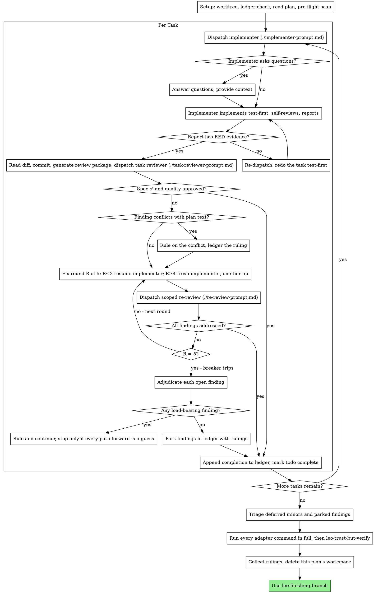

# Leo Executing Plans

**Adapted from:** Superpowers `subagent-driven-development` (MIT, https://github.com/obra/superpowers).

## Before you start

Read `.agents/leo.md` first. If it does not exist, run `leo-setup`, then continue.

Execute a plan by dispatching a fresh implementer subagent per task, a task review (spec compliance + code quality) after each, and integrating the results yourself: you review every diff and you commit.

**Why subagents:** They get isolated context. By crafting their instructions precisely, you keep them focused, and you keep your own context for coordination. They never inherit your session's history; you build exactly what they need.

**Core principle:** Fresh subagent per task + task review (spec + quality) + parent integration = high quality, fast iteration.

**Narration:** between tool calls, narrate at most one short line. The ledger and the tool results carry the record.

**Continuous execution:** Do not pause to check in between tasks. Execute all tasks from the plan without stopping. The only reasons to stop are the four named below, or all tasks complete. "Should I continue?" prompts and progress summaries waste the user's time.

**Rulings, not stalls.** A running plan does not wait on a human. Conflicts, ambiguities, plan defects, a cap you would have asked to exceed: decide them. The spec is the binding authority, the plan is its argument, and your judgment settles what neither answers. Record every decision in the ledger as `Ruling: <what you decided> — <why> — <what it costs if wrong>`, and keep going. A wrong ruling costs rework the user can see and undo; a session parked on a question costs their whole day.

Four things stop you, and only these: an irreversible or destructive operation; a security-sensitive action; a side effect outside this worktree that norms say you ask about first (a merge, a push to a shared branch, a publish); and a plan so broken that every path forward is a guess. For those, stop and ask.

## When to Use

Use when a plan exists and its tasks are mostly independent. Without a plan, use `leo-writing-plans` first. When tasks are tightly coupled, or the runtime has no subagent tool, run the same loop yourself: implement each task with `leo-tdd`, keep the ledger, review your own staged diff against [task-reviewer-prompt.md](task-reviewer-prompt.md) before each commit.

## The Process



## Setup

Work in an isolated workspace: use `leo-worktrees` to create one or verify the existing one. Never start implementation on `base-branch` without the user's explicit consent.

Conversation memory does not survive compaction. Controllers that lose their place re-dispatch entire completed task sequences, the most expensive failure there is. Track progress in a ledger file, not only in todos.

- Each plan owns a workspace: at skill start, run this skill's `bash scripts/plan-workspace PLAN_FILE`. It prints the plan's git-ignored directory (under `<repo-root>/.agents/executing-plans/`), home to every artifact for THIS plan: ledger, briefs, reports, review packages. Another plan's directory is never yours to read or write.
- Check for this plan's ledger at `<workspace>/progress.md`. If its first line names your plan file, tasks with a `Task <N>: complete` line are DONE: do not re-dispatch them; resume at the first task without one. A task whose last line is a fix round is mid-loop: resume the loop at the next round. A ledger whose first line names a different plan file is another plan's progress: leave it and start your own.
- Create the ledger with its identity as the first line: `# Ledger — plan: <plan file path>`.
- The ledger is your recovery map: the commits it names exist in git even when your context no longer remembers creating them. After compaction, trust the ledger and `git log` over your own recollection.
- `git clean -fdx` destroys the workspace (it is git-ignored scratch); if that happens, recover from `git log`.

Read the plan once, note its context and Global Constraints, and create a todo per task. If the plan names a spec, read that too: the spec is the authority the plan argues from, and conflicts inside the plan resolve against it. A plan with no reachable spec gets a ledger note saying so; rulings made without one are provisional.

Before dispatching Task 1, scan the plan once for conflicts, writing down what you checked as you check it:

- tasks that contradict each other or the plan's Global Constraints
- anything the plan explicitly mandates that the review rubric treats as a defect (a test that asserts nothing, verbatim duplication of a logic block)

The scan's output is a table, not a verdict. One row for every pair of tasks that share a file or an interface: the two tasks, what one produces against what the other consumes, and what you found. One row for every task: whether its own text agrees with itself, meaning the tests it specifies against the code it specifies, and the files it creates against the files it later touches. "The scan is clean" without those rows is not a scan you ran.

Write the table to the ledger. Rule on everything you find before execution begins, each finding against the plan text that mandates it, and record each ruling beside its row. Then dispatch Task 1. The review loop remains the net for conflicts that only emerge from implementation. The same table tells you which tasks may run in parallel (see Parallel tasks).

## Model Selection

<!-- leo:subagent-model -->
**Subagent model.** Use `subagent-model` from `.agents/leo.md` when it is set. Otherwise use one tier below your own model in the same vendor family; if you are already on the smallest tier, or cannot name your own model, use your own model. Delegate only read-heavy, independent work; design, security judgment, and final verification stay with you.
<!-- /leo:subagent-model -->

Implementers, task reviewers, and re-reviewers all take that model. Always set it explicitly when dispatching; an omitted model inherits yours. Two adjustments:

- **Fix-loop escalation (rounds 4-5):** use a model one tier above the implementer that got stuck, never above your own.
- **BLOCKED for lack of reasoning:** re-dispatch one tier up, on the same terms.

A task that needs an architecture or design decision is not delegated: decide it yourself, ledger the ruling, and put the decision in the brief.

## The Task Loop

**Batch small same-shape work.** When the plan lists several tasks that are each a small, independent edit of the same kind (the same one-line fix, constant change, or field addition repeated across files), do not dispatch one subagent per task. Compose ONE dispatch brief listing every file and its change, send the whole batch to a single subagent, and review its diff as one unit. Reserve one-dispatch-per-task for work that needs its own judgment, its own tests, or its own review surface.

Everything you paste into a dispatch prompt, and everything a subagent prints back, stays resident in your context for the rest of the session and is re-read on every later turn. Hand artifacts over as files.

**Waiting on dispatched subagents:** never poll a wait interface with short timeouts, and never sit in one silent, open-ended wait either. While you have local work (ledger updates, packaging the next review, reading reports), keep working; child results arrive on their own. When you are genuinely idle, wait in bounded stretches (five to ten minutes, where your platform allows), and between stretches post one line of status and reconcile your live children: list them, and chase any that finished without reporting.

**Parallel tasks.** One subagent per task, and tasks that share no files run at the same time. Dispatch tasks together only when, per the pre-flight table, they share no file and none consumes an interface another produces. Each dispatch lists the files the task owns. Otherwise dispatch one at a time. Parallel implementers share one working tree, so they run only focused tests and never touch git state (the implementer template says so). When a batch reports, take the tasks one by one through steps 2 to 5.

### 1. Dispatch the implementer

Record BASE (`git rev-parse HEAD`) before dispatching; the review package and fix-round diffs need it. For a parallel batch, one BASE serves the whole batch.

- **Task brief:** before dispatching, run this skill's `bash scripts/task-brief PLAN_FILE N`. It extracts the task's full text to a uniquely named file and prints the path. The brief is the single source of requirements. Your dispatch contains: (1) one line on where this task fits in the project; (2) the brief path, introduced as "read this first — it is your requirements, with the exact values to use verbatim"; (3) the files the task owns; (4) interfaces and decisions from earlier tasks that the brief cannot know; (5) your resolution of any ambiguity you noticed in the brief; (6) the report-file path and report contract. Exact values (numbers, magic strings, signatures, test cases) appear only in the brief. Never make a subagent read the whole plan file.
- **Report file:** name the implementer's report file after the brief (brief `…/task-N-brief.md` → report `…/task-N-report.md`) and put it in the dispatch prompt. The implementer writes the full report there and returns only status, files changed, a one-line test summary, and concerns.
- A dispatch prompt describes one task, not the session's history. Do not paste accumulated prior-task summaries into later dispatches. A fresh subagent needs its task, the interfaces it touches, and the global constraints. Nothing else.
- **Test-first:** the implementer template requires `leo-tdd` and a report with RED and GREEN evidence.
- **No git:** the implementer does not commit or change git state; you do. If the brief has commit or push steps, the dispatch tells it to skip them.
- **No nesting:** the implementer never dispatches subagents, not helpers and never a reviewer. Review arrives from you, after the report. A reviewer the worker spawned duplicates the task review you dispatch anyway.
- If an earlier task parked a finding in the area this task touches, carry a pointer to that ledger entry in the dispatch.
- Record the implementer's agent identity from the dispatch result; fix-loop rounds 1-3 resume this agent.

Template: [implementer-prompt.md](implementer-prompt.md)

### 2. Handle the report

Implementer subagents report one of four statuses:

**DONE:** first gate on the report file. A report without RED evidence (a failing run before the implementation) for a task that changes behavior is not DONE: re-dispatch the implementer to redo the task test-first with `leo-tdd`. A RED shown after the code was written does not count. Then integrate the task:

1. `git status --porcelain` shows changes only under the files the task owns. Anything else is an ownership violation: send it back.
2. Read the diff before committing: `git add -A -- <owned files>` then `git diff --cached -- <owned files>`. You review every diff.
3. Commit only those files. A commit hook may reformat; check `git status --porcelain` afterwards.
4. Generate the review package: `bash scripts/review-package PLAN_FILE BASE HEAD <owned files>`. It prints the unique file it wrote. BASE is the commit you recorded before dispatching, never `HEAD~1`, which silently drops all but the last commit of a multi-commit task.
5. Dispatch the task reviewer with the printed path.

**DONE_WITH_CONCERNS:** the implementer completed the work but flagged doubts. Read the concerns before proceeding. If they are about correctness or scope, address them before review. If they are observations (e.g. "this file is getting large"), note them and proceed to review.

**NEEDS_CONTEXT:** the implementer needs information that was not provided. Provide it and re-dispatch.

**BLOCKED:** the implementer cannot complete the task. Assess the blocker:
1. If it is a context problem, provide more context and re-dispatch on the same model
2. If the task requires more reasoning, re-dispatch one tier up
3. If the task is too large, break it into smaller pieces
4. If the plan itself is wrong, rule on the correction, ledger it, and re-dispatch with the ruling carried in the dispatch

**Never** ignore an escalation or force the same model to retry without changes. If the implementer said it is stuck, something needs to change.

If the implementer asks questions, before starting or mid-task, answer clearly and completely, provide additional context if needed, and don't rush it into implementation.

### 3. Review the task

Per-task reviews are task-scoped gates. Never skip the task review, and never accept a report missing either verdict: spec compliance AND task quality are both required. Implementer self-review never replaces the task review.

- Hand the reviewer its diff as a file: the package from `bash scripts/review-package PLAN_FILE BASE HEAD <owned files>` (or, without bash: `git log --oneline`, `git diff --stat`, and `git diff -U10` for the range, redirected to one uniquely named file). The output never enters your own context, and the reviewer sees the commit list, stat summary, and full diff with context in one Read call. Never dispatch a task reviewer without a diff file.
- **Reviewer inputs:** the task reviewer gets three paths (the brief file, the report file, and the review package) plus the global constraints that bind the task.
- The global-constraints block you hand the reviewer is its attention lens. Copy the binding requirements verbatim from the plan's Global Constraints section or the spec: exact values, exact formats, and the stated relationships between components ("same layout as X", "matches Y"). The reviewer's template already carries the process rules (YAGNI, test hygiene, review method); the constraints block is for what THIS project's spec demands.
- Do not add open-ended directives like "check all uses" or "run race tests if useful" without a concrete, task-specific reason
- Do not ask a reviewer to re-run tests the implementer already ran on the same code; the implementer's report carries the test evidence
- Do not pre-judge findings for the reviewer: never instruct a reviewer to ignore or not flag a specific issue. If you believe a finding would be a false positive, let the reviewer raise it and adjudicate it in the review loop. If the prompt you are writing contains "do not flag," "don't treat X as a defect," "at most Minor," or "the plan chose", stop: you are pre-judging, usually to spare yourself a review loop.

The task reviewer may report "⚠️ Cannot verify from diff" items: requirements that live in unchanged code or span tasks. These do not block the rest of the review, but you must resolve each one yourself before marking the task complete, because you hold the plan and cross-task context the reviewer lacks. If you confirm an item is a real gap, treat it as a failed spec review: it enters the fix loop with the other findings.

Template: [task-reviewer-prompt.md](task-reviewer-prompt.md)

### 4. The fix loop

The loop triggers when the review reports spec ❌, any Critical or Important finding, or a ⚠️ item you confirmed as a real gap.

Before the loop starts, two routes leave it immediately:

- Record Minor findings in the ledger as you go (`Task <N>: minor (deferred): <one-liner>`); the After the Last Task triage reads that list. A roll-up nobody reads is a silent discard. Minor findings never enter the loop.
- A finding labeled plan-mandated, or any finding that conflicts with what the plan's text requires, is yours to rule on: weigh the finding against the plan text, decide with the spec as the binding authority, and ledger the ruling before you act on it. Do not dismiss the finding because the plan mandates it, and do not dispatch a fix that contradicts the plan without a recorded ruling.

Everything else enters the loop. A fix round is one fix dispatch, your review and commit of the fix, and one scoped re-review. Five rounds maximum per task:

**Rounds 1-3: resume the original implementer.** Send it the open findings verbatim. Its context is intact: it knows the task, the code, and its own choices. If your runtime cannot send another message to a live subagent, dispatch a fresh implementer carrying the brief path, the report-file path, and the findings; the report file is the persistent memory either way.

**Rounds 4-5: dispatch a fresh implementer one tier up** (per Model Selection), with the brief path, the report-file path, the open findings, and this framing: "A prior implementer attempted this task [N] times; you own it now. Read the report file for what was tried." A loop that survives three resumes usually means the implementer cannot see its own problem: fresh eyes and a capability bump in one move.

**Every round, either way:** the implementer fixes, re-runs the tests covering the amended code (a behavior fix gets its own RED then GREEN), appends its fix report to the same report file, and returns the short contract. Before re-dispatching the reviewer, confirm the fix report contains the covering tests, the command run, and the output. Then you read the diff and commit it as in step 2, and dispatch the re-review. Name the covering test files in the fix message; a one-line fix does not need the whole suite.

**The re-review is scoped.** Run `bash scripts/review-package PLAN_FILE FIX_BASE HEAD <owned files>` where FIX_BASE is the head the previous review saw, and dispatch [re-review-prompt.md](re-review-prompt.md) with the findings list, the brief, the report file, and the printed diff path. The re-reviewer verdicts each finding ADDRESSED or NOT ADDRESSED and flags new breakage in the fix diff only. New Critical/Important breakage in the fix diff joins the open findings list. Out-of-scope observations go to the ledger as deferred minors; they never extend the loop.

**After each round,** append to the ledger: `Task <N>: fix round <R>/5 (<X> addressed, <Y> open — <finding one-liners>; commits <a7>..<b7>)`

Never fix findings yourself in the controller session: your context stays clean for coordination, and controller fixes skip review.

**The breaker.** When round 5's re-review still leaves findings open, stop dispatching. Adjudicate each open finding yourself; you hold the plan and the cross-task context the reviewer lacks:

- **The reviewer is wrong, or the point is contestable:** park it: `Task <N>: parked — <finding> — Ruling: <why the code stands>`. The triage step sees both sides.
- **Real, but nothing downstream builds on it:** park it the same way, with a ruling that says it is real and deferred.
- **Real and load-bearing** (a later task builds on it, or it reveals a plan defect): rule on the smallest change that unblocks the dependent work, ledger it as `Task <N>: Ruling: <finding> — <what you decided and why>`, and carry it into the next task's dispatch. Parking a structural failure silently lets every dependent task build on it. Stop only when the defect leaves every path forward a guess.

Adjudicate only at the cap. Adjudicating earlier to end a loop is pre-judging with a different name. Every adjudication is a ledger entry; a silent discard is forbidden.

### 5. Complete the task

When the review comes back clean, or every open finding is parked with a ruling at the cap, append the completion line to the ledger in the same message as your other bookkeeping:

- `Task <N>: complete (commits <base7>..<head7>, review clean)`
- `Task <N>: complete (commits <base7>..<head7>, <K> parked)` after a tripped breaker

Then mark the todo complete and move on. Never move to the next task while the review has open Critical/Important issues that are neither fixed nor parked-with-ruling at the cap.

## After the Last Task

1. **Triage.** Read the ledger's deferred-minor and parked lines. Any that affects correctness goes out as ONE fix dispatch with the complete list (not one fixer per finding), then one scoped re-review of that fix range. Adjudicate residuals as in the breaker.
2. **Full checks, by you.** Run every command set in the `Commands` section of `.agents/leo.md` in full on the final tree: `format` only when `formatting-owner` is `command`, then `lint`, `typecheck`, `test`, `build`, skipping blank ones. Reports are claims; these runs are evidence. A failure goes back through a fix dispatch with the complete failure list and a scoped re-review, then you rerun everything.
3. **Verify.** Run `leo-trust-but-verify` on the branch. Its verdict, not your impression, says whether the work is done.
4. **Rulings.** Before you delete anything, collect every ledger line containing `Ruling:` (preflight rulings, parked findings, breaker adjudications, all of them) into your final message under "Rulings I made", in the order you made them, each with what it costs if wrong. The list is exhaustive: if the ledger holds a ruling, the list holds it. It is the only place the decisions you took on the user's behalf reach them. A ruling that dies with the workspace was a decision made in secret.
5. **Clean up.** Delete this plan's workspace (`rm -rf <workspace>`); the git history is the record now. Sibling directories belong to other plans: leave them alone.
6. **Finish.** Use `leo-finishing-branch`.

## Common Rationalizations

| Excuse | Reality |
|--------|---------|
| "Close enough on spec compliance" | Reviewer found spec gaps = not done. Fix or hit the cap and adjudicate: those are the only exits. |
| "I'll fix it myself, dispatching is overhead" | Controller fixes pollute your context and skip review. Resume the implementer. |
| "One more round will converge" | Past the cap, rounds don't converge; the failure is structural. Adjudicate and route. |
| "The reviewer will just find something new anyway" | Scoped re-reviews verify fixes; they cannot wander. New findings on untouched code go to the ledger, not the loop. |
| "This finding is obviously wrong, I'll drop it" | You adjudicate only at the cap, and every ruling is a ledger entry. Silent discards are forbidden. |
| "The fix was small, skip the re-review" | Unreviewed fixes are how regressions land. Every round ends with a scoped re-review. |
| "Reviews slow the loop down" | The loop without reviews is just unverified churn. Reviews are the loop's brakes and steering. |
| "Ledger bookkeeping is overhead" | The ledger is what survives compaction. Controllers without one have re-dispatched entire completed task sequences. |
| "The implementer spawned its own reviewer, free extra assurance" | It's a duplicate seat reviewing the same diff; the task review is the gate. A worker-spawned reviewer is a defect to flag, not rigor. |
| "The tests pass, the report doesn't need RED" | A test never seen failing proves nothing. No RED evidence, no review: re-dispatch. |
| "Let the implementer commit, it saves a step" | Parallel tasks share one tree; a worker's `git add` sweeps in a sibling's files. You stage the owned files, read the diff, and commit. |
| "These two tasks probably don't touch the same files" | Probably is not a table row. Parallel only what the pre-flight table shows shares nothing. |

## Example Workflow

```
You: I'm using leo-executing-plans to execute this plan.

[Setup: worktree verified]
[Read plan file once: .agents/plans/feature-plan.md]
[Resolve workspace: bash scripts/plan-workspace .agents/plans/feature-plan.md, no ledger inside, fresh start]
[Pre-flight table: Tasks 1 and 2 share no file; Task 3 consumes Task 2's interface]
[Create todos for all tasks]

Tasks 1 and 2 (parallel batch, BASE a1b2c3d)

[Run task-brief for each; dispatch both implementers with brief + owned files + report paths]

Implementer 1: "Before I begin, should the hook be installed at user or system level?"
You: "User level."

Implementer 1: [Later] DONE. Report has RED (5 failing) and GREEN (5/5 passing).
Implementer 2: [No questions] DONE. Report has RED and GREEN.

[Task 1: status shows only owned files; git add owned files; read diff; commit]
[Run review-package PLAN_FILE a1b2c3d HEAD <Task 1 files>; dispatch task reviewer]
Task reviewer: Spec ✅. Task quality: Approved.
[Ledger: Task 1: complete (commits a1b2c3d..d4e5f6a, review clean)]

[Task 2: read diff; commit; review package; dispatch reviewer]
Task reviewer: Spec ❌: missing progress reporting (spec says "report every 100 items").
  Important: magic number (100)

[Fix round 1: resume the implementer with both findings]
Implementer 2: Added progress reporting, extracted PROGRESS_INTERVAL. Re-ran the
  recovery test (RED then GREEN in the fix report), 10/10 passing.

[Read fix diff; commit; review-package FIX_BASE HEAD <Task 2 files>; dispatch scoped re-review]
Re-reviewer: both ADDRESSED. New breakage: none.
[Ledger: Task 2: fix round 1/5 (2 addressed, 0 open; commits d4e5f6a..b7c8d9e)]
[Ledger: Task 2: complete (commits d4e5f6a..b7c8d9e, review clean)]

...

[After all tasks: triage minors; run lint, typecheck, test, build myself; leo-trust-but-verify: PROVEN]
[Final message lists "Rulings I made"; delete this plan's workspace]

Done. Using leo-finishing-branch.
```
