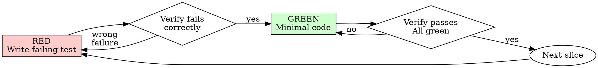

# Test-Driven Development (TDD)

**Adapted from:** Superpowers `test-driven-development` (MIT, https://github.com/obra/superpowers) + MattPocock `tdd` (MIT, https://github.com/mattpocock/skills).

## Before you start

Read `.agents/leo.md` first. If it does not exist, run `leo-setup`, then continue.

## Overview

Write the test first. Watch it fail. Write minimal code to pass.

**Core principle:** If you didn't watch the test fail, you don't know if it tests the right thing.

**Violating the letter of the rules is violating the spirit of the rules.**

## When to Use

**Always:**
- New features
- Bug fixes
- Refactoring
- Behavior changes

**Exceptions (ask your human partner):**
- Throwaway prototypes
- Generated code
- Configuration files

Thinking "skip TDD just this once"? Stop. That's rationalization.

## Before The First Edit

Read the files in `rules-files` and `standards-router` from `.agents/leo.md`. Do this once per
session, before the first RED test is written. On each GREEN, record the rules the slice
applied, named by `rule-id-convention` when one is set (for example `<PREFIX>-NNN`). A deviation is named inline where it
happens, with its reason.

`formatting-owner` says who formats. `hook`: never run a formatter or an auto-fix (the `format`
and `lint-fix` commands); a format or lint error in code you wrote is fixed by hand, so the fix
is reviewed like any other edit. `command`: run the `format` command. `none`: match the
surrounding style by hand.

## Standards

When `standards-router` in `.agents/leo.md` is set, read it, load only the files it routes to for this task, and cite rule IDs per `rule-id-convention` in findings and in the PR description. A deviation from a MUST rule names the rule and the reason where the deviation lives.

## The Iron Law

```
NO PRODUCTION CODE WITHOUT A FAILING TEST FIRST
```

Write code before the test? Delete it. Start over.

**No exceptions:**
- Don't keep it as "reference"
- Don't "adapt" it while writing tests
- Don't look at it
- Delete means delete

Implement fresh from tests. Period.

## Seams: Where Tests Go (MattPocock)

A **seam** is the public boundary you test at: the interface where you observe behavior without reaching inside. Tests live at seams, never against internals.

**Test only at pre-agreed seams.** Before writing any test, write down the seams under test and confirm them with the user. No test is written at an unconfirmed seam. You can't test everything, so agreeing the seams up front is how testing effort lands on the critical paths and complex logic instead of every edge case.

Ask: "What's the public interface, and which seams should we test?"

When the shape of that interface is itself in question (how deep the module is, where the seam belongs, what the interface should expose), invoke `leo-codebase-design` for the vocabulary. It is the shared source of the module, interface, depth, seam, adapter, leverage and locality terms.

## Anti-patterns

| Pattern | Description |
|---------|-------------|
| **Implementation-coupled** | Mocks internal collaborators, tests private methods, or verifies through a side channel (querying DB instead of interface). Tell: test breaks when you refactor but behavior hasn't changed. |
| **Tautological** | Assertion recomputes expected value the way code does (`expect(add(a,b)).toBe(a+b)`). Passes by construction, never disagrees. Expected values must come from independent source: known-good literal, worked example, spec. |
| **Horizontal slicing** | Writing all tests first, then all implementation. Bulk tests verify _imagined_ behavior. Work in **vertical slices** instead: one test → one implementation → repeat. |
| **Test passes immediately** | You're testing existing behavior. Fix test. |
| **Code before test** | Delete code. Start over. |
| **Can't explain why test failed** | Don't understand the failure. Return to RED. |

When writing or changing any test, read [writing-good-tests.md](writing-good-tests.md) for the rules that keep tests honest:
- Name the production change that would make the test fail — before writing it
- Assert on real behavior, never on mock behavior
- Keep test-only code in test utilities, out of production classes
- Understand a dependency's side effects before mocking it

## Rules of the Loop

| Rule | Meaning |
|------|---------|
| **Red before green** | Failing test exists first, then only enough code to pass it. Nothing speculative. |
| **One slice at a time** | One seam, one test, one minimal implementation per cycle. Two behaviors in one RED test is a batch: split it, run the cycle twice. |
| **Refactoring is not part of the loop** | Cleanup happens after the slices are green (`leo-simplify`). Reshaping mid-cycle mixes a behavior change with a structural one; neither gets watched failing. |

## Red-Green



### RED - Write Failing Test

Write one minimal test showing what should happen.

<Good>
```typescript
test('retries failed operations 3 times', async () => {
  let attempts = 0;
  const operation = () => {
    attempts++;
    if (attempts < 3) throw new Error('fail');
    return 'success';
  };

  const result = await retryOperation(operation);

  expect(result).toBe('success');
  expect(attempts).toBe(3);
});
```
Clear name, tests real behavior, one thing
</Good>

<Bad>
```typescript
test('retry works', async () => {
  const mock = jest.fn()
    .mockRejectedValueOnce(new Error())
    .mockRejectedValueOnce(new Error())
    .mockResolvedValueOnce('success');
  await retryOperation(mock);
  expect(mock).toHaveBeenCalledTimes(3);
});
```
Vague name, tests mock not code
</Bad>

**Requirements:**
- One behavior
- Clear name
- Real code (no mocks unless unavoidable)

### Verify RED - Watch It Fail (MANDATORY. Never skip.)

Run the one test file with the `test` command from `.agents/leo.md`, narrowed to that file, never the whole suite.

```bash
<test command> path/to/test.test.ts
```

Confirm:
- Test fails (not errors)
- Failure message is expected
- Fails because feature missing (not typos)

**Test passes?** You're testing existing behavior. Fix test.

**Test errors?** Fix error, re-run until it fails correctly.

### GREEN - Minimal Code (Vertical Slice)

Write simplest code to pass the test.

<Good>
```typescript
async function retryOperation<T>(fn: () => Promise<T>): Promise<T> {
  for (let i = 0; i < 3; i++) {
    try {
      return await fn();
    } catch (e) {
      if (i === 2) throw e;
    }
  }
  throw new Error('unreachable');
}
```
Just enough to pass
</Good>

<Bad>
```typescript
async function retryOperation<T>(
  fn: () => Promise<T>,
  options?: {
    maxRetries?: number;
    backoff?: 'linear' | 'exponential';
    onRetry?: (attempt: number) => void;
  }
): Promise<T> {
  // YAGNI
}
```
Over-engineered
</Bad>

Don't add features, refactor other code, or "improve" beyond the test.

### Verify GREEN - Watch It Pass (MANDATORY.)

Same single-file command as RED:

```bash
<test command> path/to/test.test.ts
```

Confirm:
- Test passes
- Output pristine (no errors, warnings)

**Test fails?** Fix code, not test.

The `test` suite scoped to the affected package and the `typecheck` command run once, after the last slice, before reporting. Run whichever of the two the affected package defines. A change with neither runs the check the task names.

**Other tests fail?** Fix now. The full-repo run (`test`, `typecheck`, `lint`) belongs to whoever integrates the work, after integration, not to a delegated task.

### Repeat

Next failing test for next slice. Not a batch collected in advance.

## After The Slices Are Green

Cleanup belongs here, on the whole diff, never inside a cycle:

- Remove duplication
- Improve names
- Extract helpers

Tests stay green; no behavior a test does not already cover. This is `leo-simplify`, then `leo-trust-but-verify` before any claim of done.

## Good Tests (MattPocock)

| Quality | Good | Bad |
|---------|------|-----|
| **Minimal** | One thing. "and" in name? Split it. | `test('validates email and domain and whitespace')` |
| **Clear** | Name describes behavior | `test('test1')` |
| **Shows intent** | Demonstrates desired API | Obscures what code should do |

## Why Order Matters

**"I'll write tests after to verify it works"**

Tests written after code pass immediately. Passing immediately proves nothing:
- Might test wrong thing
- Might test implementation, not behavior
- Might miss edge cases you forgot
- You never saw it catch the bug

Test-first forces you to see the test fail, proving it actually tests something.

**"I already manually tested all the edge cases"**

Manual testing is ad-hoc. You think you tested everything but:
- No record of what you tested
- Can't re-run when code changes
- Easy to forget cases under pressure
- "It worked when I tried it" ≠ comprehensive

Automated tests are systematic. They run the same way every time.

**"Deleting X hours of work is wasteful"**

Sunk cost fallacy. The time is already gone. Your choice now:
- Delete and rewrite with TDD (X more hours, high confidence)
- Keep it and add tests after (30 min, low confidence, likely bugs)

The "waste" is keeping code you can't trust. Working code without real tests is technical debt.

**"TDD is dogmatic, being pragmatic means adapting"**

TDD IS pragmatic:
- Finds bugs before commit (faster than debugging after)
- Prevents regressions (tests catch breaks immediately)
- Documents behavior (tests show how to use code)
- Enables refactoring (change freely, tests catch breaks)

"Pragmatic" shortcuts = debugging in production = slower.

**"Tests after achieve the same goals - it's spirit not ritual"**

No. Tests-after answer "What does this do?" Tests-first answer "What should this do?"

Tests-after are biased by your implementation. You test what you built, not what's required. You verify remembered edge cases, not discovered ones.

Tests-first force edge case discovery before implementing. Tests-after verify you remembered everything (you didn't).

30 minutes of tests after ≠ TDD. You get coverage, lose proof tests work.

## Common Rationalizations

| Excuse | Reality |
|--------|---------|
| "Too simple to test" | Simple code breaks. Test takes 30 seconds. |
| "I'll test after" | Tests passing immediately prove nothing. |
| "Tests after achieve same goals" | Tests-after = "what does this do?" Tests-first = "what should this do?" |
| "Already manually tested" | Ad-hoc ≠ systematic. No record, can't re-run. |
| "Deleting X hours is wasteful" | Sunk cost fallacy. Keeping unverified code is technical debt. |
| "Keep as reference, write tests first" | You'll adapt it. That's testing after. Delete means delete. |
| "Need to explore first" | Fine. Throw away exploration, start with TDD. |
| "Test hard = design unclear" | Listen to test. Hard to test = hard to use. |
| "TDD will slow me down" | TDD faster than debugging. Pragmatic = test-first. |
| "Manual test faster" | Manual doesn't prove edge cases. You'll re-test every change. |
| "Existing code has no tests" | You're improving it. Add tests for existing code. |

## Red Flags - STOP and Start Over

- Code before test
- Test after implementation
- Test passes immediately
- Can't explain why test failed
- Tests added "later"
- Rationalizing "just this once"
- "I already manually tested it"
- "Tests after achieve the same purpose"
- "It's about spirit not ritual"
- "Keep as reference" or "adapt existing code"
- "Already spent X hours, deleting is wasteful"
- "TDD is dogmatic, I'm being pragmatic"
- "This is different because..."

**All of these mean: Delete code. Start over with TDD.**

## Example: Bug Fix

**Bug:** Empty email accepted

**RED**
```typescript
test('rejects empty email', async () => {
  const result = await submitForm({ email: '' });
  expect(result.error).toBe('Email required');
});
```

**Verify RED**
```bash
$ <test command> src/forms/submitForm.test.ts
FAIL: expected 'Email required', got undefined
```

**GREEN**
```typescript
function submitForm(data: FormData) {
  if (!data.email?.trim()) {
    return { error: 'Email required' };
  }
  // ...
}
```

**Verify GREEN**
```bash
$ <test command> src/forms/submitForm.test.ts
PASS
```

**Cleanup** waits for the gate, not this cycle. Next RED is the next slice.

## Verification Checklist

Before marking work complete:

- [ ] Every new function/method has a test
- [ ] Watched each test fail before implementing
- [ ] Each test failed for expected reason (feature missing, not typo)
- [ ] Wrote minimal code to pass each test
- [ ] All tests pass
- [ ] Output pristine (no errors, warnings)
- [ ] Tests use real code (mocks only if unavoidable)
- [ ] Edge cases and errors covered
- [ ] Tests written at confirmed seams (MattPocock)
- [ ] Vertical slices: one test → one impl → repeat (MattPocock)
- [ ] If refactoring happened, it happened after the slices, not inside a cycle

Can't check all boxes? You skipped TDD. Start over.

## When Stuck

| Problem | Solution |
|---------|----------|
| Don't know how to test | Write wished-for API. Write assertion first. Ask your human partner. |
| Test too complicated | Design too complicated. Simplify interface. |
| Must mock everything | Code too coupled. Use dependency injection. |
| Test setup huge | Extract helpers. Still complex? Simplify design. |

## Debugging Integration

Bug found? Write failing test reproducing it. Follow TDD cycle. Test proves fix and prevents regression.

Never fix bugs without a test.

## Final Rule

```
Production code → test exists and failed first
Otherwise → not TDD
```

No exceptions without your human partner's permission.
